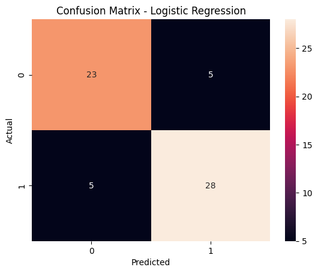
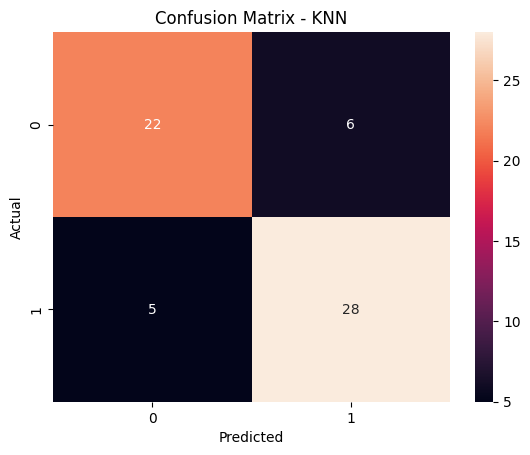
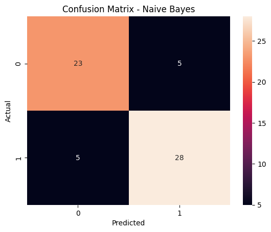
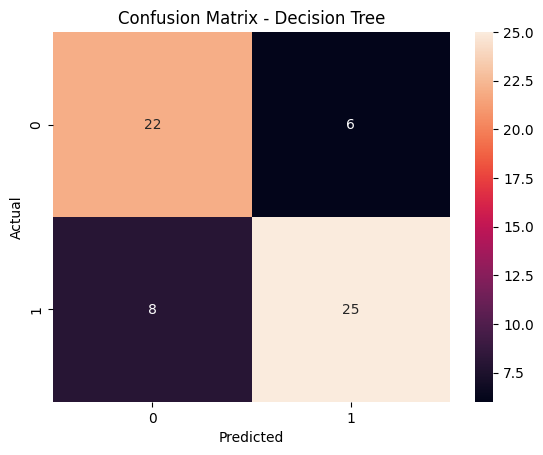
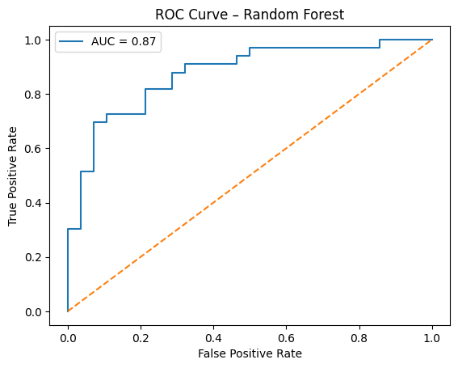
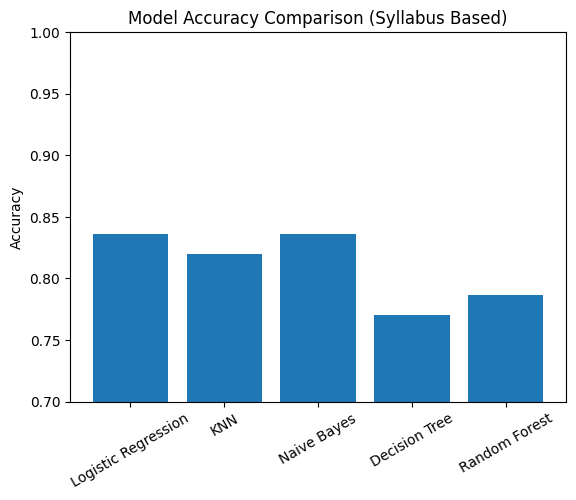

```python
import pandas as pd
import numpy as np
import matplotlib.pyplot as plt
import seaborn as sns

from sklearn.model_selection import train_test_split, GridSearchCV
from sklearn.preprocessing import StandardScaler
from sklearn.pipeline import Pipeline

from sklearn.metrics import accuracy_score, roc_auc_score
from sklearn.linear_model import LogisticRegression
from sklearn.neighbors import KNeighborsClassifier
from sklearn.tree import DecisionTreeClassifier
from sklearn.naive_bayes import GaussianNB
from sklearn.ensemble import RandomForestClassifier

from sklearn.metrics import (
    accuracy_score,
    confusion_matrix,
    classification_report,
    roc_curve,
    roc_auc_score
)

```


```python
df = pd.read_csv("HeartDiseaseTrain-Test.csv")
df

df = df.drop_duplicates()
df = pd.get_dummies(df, drop_first=True)

X = df.drop("target", axis=1)
y = df["target"]

X_train, X_test, y_train, y_test = train_test_split(
    X, y, test_size=0.2, random_state=42, stratify=y
)

```


```python
models = {
    "Logistic Regression": Pipeline([
        ("scaler", StandardScaler()),
        ("model", LogisticRegression(max_iter=1000))
    ]),

    "KNN": Pipeline([
        ("scaler", StandardScaler()),
        ("model", KNeighborsClassifier(n_neighbors=5))
    ]),

    "Naive Bayes": Pipeline([
        ("model", GaussianNB())
    ]),

    "Decision Tree": Pipeline([
        ("model", DecisionTreeClassifier(random_state=42))
    ])
}

```


```python
accuracy_results = {}

for name, model in models.items():

    model.fit(X_train, y_train)
    y_pred = model.predict(X_test)

    acc = accuracy_score(y_test, y_pred)
    accuracy_results[name] = acc

    print("\n", "="*50)
    print(f"MODEL : {name}")
    print("Accuracy:", acc)
    print(classification_report(y_test, y_pred))

    # Confusion Matrix
    cm = confusion_matrix(y_test, y_pred)
    plt.figure()
    sns.heatmap(cm, annot=True, fmt="d")
    plt.title(f"Confusion Matrix - {name}")
    plt.xlabel("Predicted")
    plt.ylabel("Actual")
    plt.show()

```

    
     ==================================================
    MODEL : Logistic Regression
    Accuracy: 0.8360655737704918
                  precision    recall  f1-score   support
    
               0       0.82      0.82      0.82        28
               1       0.85      0.85      0.85        33
    
        accuracy                           0.84        61
       macro avg       0.83      0.83      0.83        61
    weighted avg       0.84      0.84      0.84        61
    
    


    

    


    
     ==================================================
    MODEL : KNN
    Accuracy: 0.819672131147541
                  precision    recall  f1-score   support
    
               0       0.81      0.79      0.80        28
               1       0.82      0.85      0.84        33
    
        accuracy                           0.82        61
       macro avg       0.82      0.82      0.82        61
    weighted avg       0.82      0.82      0.82        61
    
    


    

    


    
     ==================================================
    MODEL : Naive Bayes
    Accuracy: 0.8360655737704918
                  precision    recall  f1-score   support
    
               0       0.82      0.82      0.82        28
               1       0.85      0.85      0.85        33
    
        accuracy                           0.84        61
       macro avg       0.83      0.83      0.83        61
    weighted avg       0.84      0.84      0.84        61
    
    


    

    


    
     ==================================================
    MODEL : Decision Tree
    Accuracy: 0.7704918032786885
                  precision    recall  f1-score   support
    
               0       0.73      0.79      0.76        28
               1       0.81      0.76      0.78        33
    
        accuracy                           0.77        61
       macro avg       0.77      0.77      0.77        61
    weighted avg       0.77      0.77      0.77        61
    
    


    

    


```python
rf = RandomForestClassifier(random_state=42)

param_grid = {
    "n_estimators": [200, 300],
    "max_depth": [10, 20, None],
    "min_samples_split": [2, 5]
}

rf_grid = GridSearchCV(
    rf,
    param_grid,
    cv=5,
    scoring="accuracy",
    n_jobs=-1
)

rf_grid.fit(X_train, y_train)

best_rf = rf_grid.best_estimator_

rf_pred = best_rf.predict(X_test)
rf_prob = best_rf.predict_proba(X_test)[:, 1]

print("\nRANDOM FOREST (FINAL MODEL)")
print("Accuracy:", accuracy_score(y_test, rf_pred))
print(classification_report(y_test, rf_pred))

```

    
    RANDOM FOREST (FINAL MODEL)
    Accuracy: 0.7868852459016393
                  precision    recall  f1-score   support
    
               0       0.76      0.79      0.77        28
               1       0.81      0.79      0.80        33
    
        accuracy                           0.79        61
       macro avg       0.79      0.79      0.79        61
    weighted avg       0.79      0.79      0.79        61
    
    


```python
m = confusion_matrix(y_test, rf_pred)

plt.figure()
sns.heatmap(cm, annot=True, fmt="d")
plt.title("Confusion Matrix – Random Forest")
plt.xlabel("Predicted")
plt.ylabel("Actual")
plt.show()
```


    

    


```python
fpr, tpr, _ = roc_curve(y_test, rf_prob)
auc = roc_auc_score(y_test, rf_prob)

plt.figure()
plt.plot(fpr, tpr, label=f"AUC = {auc:.2f}")
plt.plot([0,1], [0,1], linestyle="--")
plt.xlabel("False Positive Rate")
plt.ylabel("True Positive Rate")
plt.title("ROC Curve – Random Forest")
plt.legend()
plt.show()

```


    

    


```python
accuracy_results["Random Forest"] = accuracy_score(y_test, rf_pred)

plt.figure()
plt.bar(accuracy_results.keys(), accuracy_results.values())
plt.ylim(0.7, 1.0)
plt.ylabel("Accuracy")
plt.title("Model Accuracy Comparison (Syllabus Based)")
plt.xticks(rotation=30)
plt.show()

```


    

    


```python

```
